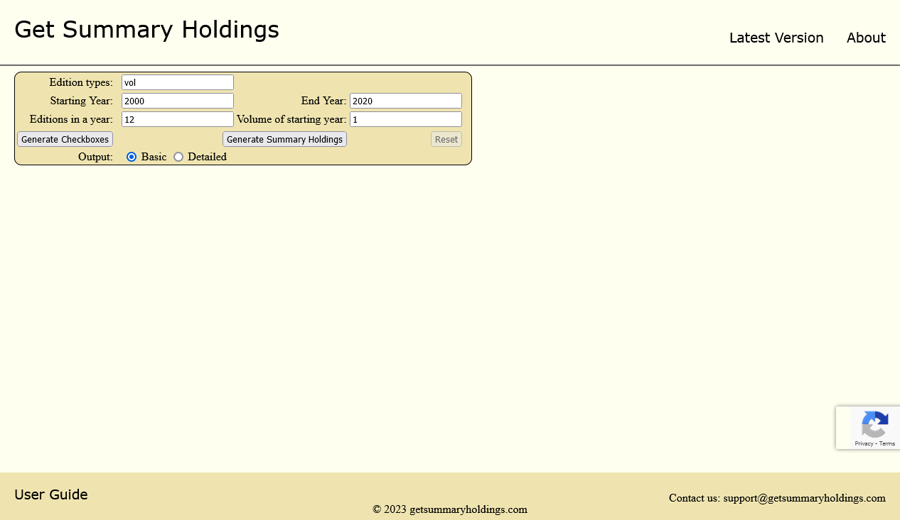

# Get Summary Holdings (GSH)

#### Production URL: [https://jjose14-jacob-jose.github.io/getSummaryHoldings/](https://jjose14-jacob-jose.github.io/getSummaryHoldings/)

## About GSH
* GSH can be called a calculator that allows you to get summary of periodicals in the context of a library.
* GSH helps you to quickly get a summary the available and unavailable periodicals or publications by simply clicking buttons.

### Project URLs
This is the Lite interface of the GSH. You view the new, interactive interface at https://getsummaryholdings.com/. 

Both interfaces connect to the Java Spring Boot REST API at: [https://editiontracker.azurewebsites.net/](https://editiontracker.azurewebsites.net/)

Git repository for the REST API: [https://github.com/jjose14-Jacob-Jose/clrb-edition_tracker](https://github.com/jjose14-Jacob-Jose/clrb-edition_tracker)

## Tech Stack
* JavaScript
* HTML
* CSS

### Running the Project
To run the project:
1. Clone and run the Java Spring Boot backend ([click here for instructions](https://github.com/jjose14-Jacob-Jose/clrb-edition_tracker#running-the-project-with)).  
2. Set the value of the JavaScript variable in the file **js/main.js** to `const URL_GENERATE_SUMMARY = http://localhost:8080/`
3. Run _index.html_ in your preferred browser. 